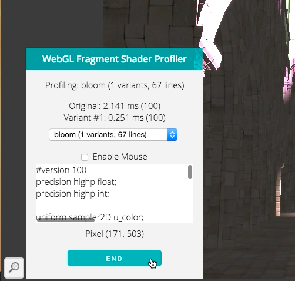
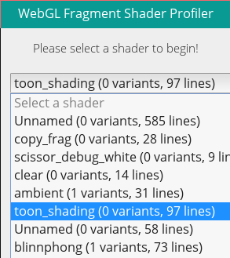

# WebGL Fragment Shader Profiler
[CIS565][cis565] Final Project,
[Terry Sun](http://terrysun.blue) &
[Sally Kong](http://www.kongsally.com/)

## [Video](https://www.youtube.com/watch?v=iM2nibuqaWU)

There are many tools for [profiling JavaScript/WebGL applications][profile], but
none (?) which profile the actual shaders. However, shaders can end up doing
quite a bit of heavy lifting, and we want to minimize the
amount of time they take so Javascript can have all of the fun.

We have built a tool for profiling fragment shaders, potentially a Chrome
extension. This would run on a webpage, access the GLSL programs running on it,
and profile the fragment shader(s) over different pixels.

  [cis565]: cis565-fall-2015.github.io
  [profile]: http://www.realtimerendering.com/blog/webgl-debugging-and-profiling-tools/

### Acknowledgements

Inspiration for hijacking WebGLContexts was found by looking at
[Chrome Shader Editor Extension][shader-editor] and
[WebGL Inspector][webgl-inspector]. (All code in this repository was written by
us.)

  [shader-editor]: https://github.com/spite/ShaderEditorExtension
  [webgl-inspector]: https://benvanik.github.io/WebGL-Inspector/

Finally, thanks to Patrick Cozzi and Kai Ninomiya for teaching and TAing
(respectively) CIS565.

### Installation Instructions

This extension relies on the [WebGL disjoint timer query][disjoint-timer]
extension, which is currently only available on pre-release version of Chrome
(Chrome Canary or Chromium). Additionally, you need to enable WebGL draft
extensions at "chrome://flags". You should check that
"EXT\_disjoint\_timer\_query" is listed at
[http://webglreport.com/](http://webglreport.com/).

  [disjoint-timer]: https://www.khronos.org/registry/webgl/sdk/tests/conformance/extensions/ext-disjoint-timer-query.html

Then:

1. Download this git repository:
    `git clone https://github.com/terrynsun/WebGL-Fragment-Shader-Profiler.git`.
2. Go to `chrome://extensions` and enable Developer Settings (top right corner).
3. Click "Load unpacked extension" and select `src` from this repo.
4. Find a WebGL app to play with! The extension will show itself as an icon in
   the bottom left.

### Overview

This Chrome extension injects JavaScript into a webpage, which...

1. Inserts a panel into the page, which allows you to select
   individual shaders for profiling, and reporting the timing data.
2. Allows a user to mark up their shaders with custom `#pragma` lines, selecting
   parts of the shaders to disable. This reveals the performance impact of parts
   of the shader.
3. Allows a user to profile just a section of their shader by using the mouse to
   mouse over a target region.

#### WebGL Handling

This extension overwrites several functions in `WebGLRenderingContext` before
the page is loaded in order to get access to the GL state of the page.

By overwriting `createShader`, `shaderSource, `createProgram`, `attachShader`, we
can obtain (and store) a list of shaders (and their sources) and programs (and
their shaders).

#### Shader Variants

A "shader variant" is a modified user-uploaded shader, with some of its
potentially expensive computational calls replaced with no-ops.

Using the saved shader sources, we can search and modify the uploaded shader
source code. Shader variants are surrounded by `#pragma profile start` and
`#pragma profile end`. GLSL code within the block will be replaced with no-ops
(eg. `vec4(0)`), and the shader will be re-compiled.

In order to run shader variants with the same data as the original, texture and
uniform binding GL calls are "cascaded" from the original program to all of its
associated variants when they are made, such that each variant runs with the
same set of uniforms as its original program. Thus, the only difference between
the original shader and any of its variants is the difference in code.

Additionally, there is an option that will automatically replace all `texture2D`
calls with no-ops.

#### Mouse

When mouseover is enabled, the profiler will restrict drawing to a small
portion of the canvas surrounding the mouse, and will report shader timing
accordingly.

On a draw call, this queries the WebGL context for any existing GLScissor
configuration. If one exists, the profiler will re-compute a scissor bound by
taking the intersection of the mouse-selected area and the existing scissor box.
(If no intersection exists, the draw will simply be skipped.)

This reveals differences in performance between different portions of the
shader. For example, a program with complicated geometry in one only portion of
the canvas.

![] (img/mouse_selection.gif)

### Results & Impact

We looked into some shader experiments in http://www.kevs3d.co.uk/dev/shaders/ and measured the execution time of some of the shaders

|Distance Field | Distance Field Waves | Mandelbulb | Animated CSG Shape |
|:-------------:|:-------------:|:-------------:|:-------------:|
| |  | |  |
| 13.5 ms | 32.4 ms | 33.8 ms | 7.5 ms |

We forked the deferred shader of Megan Moore: https://github.com/megmo21/Project6-WebGL-Deferred-Shading then added pragma variants to profile the bloom filter, blinnphong, and ambient shader on. These are the results of the execution time. The left stack represents the execution time of the original code, while the right stack represents the execution time of the code recompiled by the WebGL Shader Profiler where all function calls such as texture2D() were replaced by no-ops. 

![] (img/graph.png)

### Wishlist

A todo section, for the Future. Suggest more!

* Add additional pre-built options, e.g. "disable all texture2D calls".
* Generate more than one shader variant at a time.
* Check out why it crashes / causes crashing (eg. many three.js demos).
* Make sure to load everything in order (sometimes an error is thrown because JS is loaded out of order).
    * Include an option to re-check the page for a Canvas element. (WIP).

### Presentations

Class presentations can be found here:

* [Pitch](https://docs.google.com/presentation/d/1ql6i_PHFyAe6U6gH-zOUKhpxpAzX0TQIN0ZWSS-D-2A/edit?usp=sharing)
* [Milestone 1](https://docs.google.com/presentation/d/1SiUU418lQQzw1nnS0Zcmk2OT4B24SbFRJwTcBvBYxPY/edit?usp=sharing)
* [Milestone 2](https://docs.google.com/presentation/d/1HPLnnpjw2ReZOZ5Td3XHB_Z3rfg1j9FKO2kJrvgp9os/edit?usp=sharing)
* [Milestone 3](https://docs.google.com/presentation/d/1upIHXKcaad5nB-Nd1lpLAzsPMyScnBzAQUJCbzc4_m4/edit?usp=sharing)
* [Milestone 4](https://docs.google.com/presentation/d/1c7s_22Zo8IYG6FWvKAEqLfBznxyj_ytWnPDWKFXVl40/edit?usp=sharing)
* [Final] (https://docs.google.com/presentation/d/1c7s_22Zo8IYG6FWvKAEqLfBznxyj_ytWnPDWKFXVl40/edit?ts=566a27e8#slide=id.gdafbcba01_1_59)
