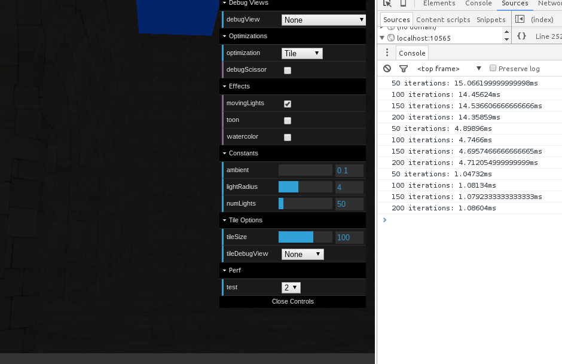

Progress, using deferred shader project as a base:

* WebGL EXT_disjoint_timer_query extension working!

  * Very simple Timer API.

* Simple fragment shader modification with user-delimited sections.
* Compilation and shader substitution (within deferred shader).

  * Replace texture reads with uniform or constant.
  * Original ~14.2ms, uniform ~4.6ms, constant ~1.1ms (due to const elimination).

```
float lightIdx;
vec4 lightPR;
vec4 lightC;

/// START 2
lightIdx = vec4(0).x;
lightPR  = vec4(0);
lightC   = vec4(0);

lastLightIdx = lightIdx;
/// END 2

/// START 1
lightIdx = u_zero.x;
lightPR  = u_zero;
lightC   = u_zero;

lastLightIdx = lightIdx;
/// END 1

/// START 0
lightIdx = texture2D(u_lightIndices, offsetIdx).x;
lastLightIdx = lightIdx;

lightPR = texture2D(u_lightsPR, vec2(lightIdx, 0));
lightC  = texture2D(u_lightsC,  vec2(lightIdx, 0));
/// END 0
```


